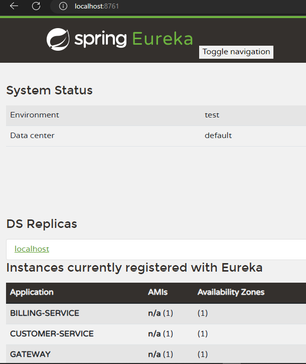
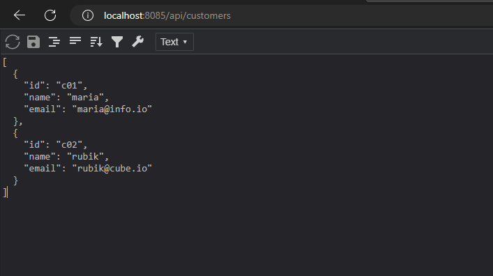
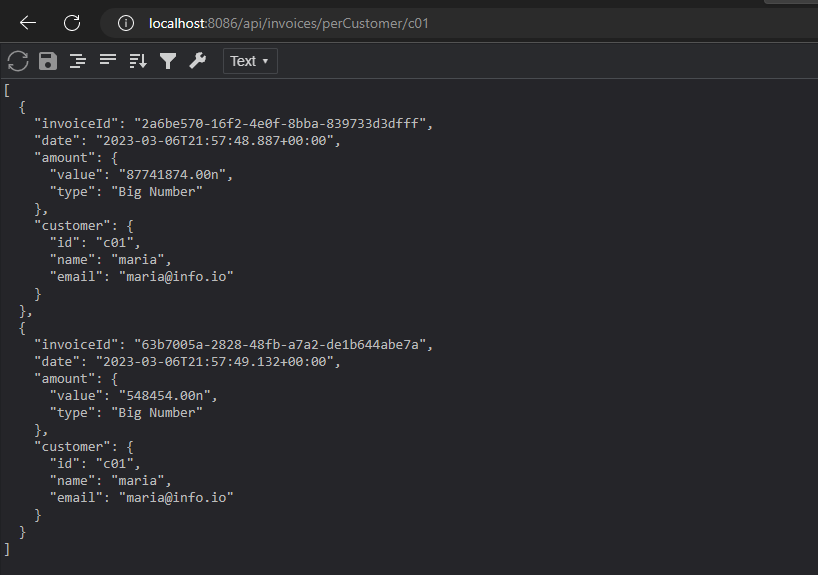

## General notes

- This is a basic example of micro services, i was working on it when i was learning about
  micro services from Professor Mohamed Youssfi's lectures.
- The projects contains 4 sections, the dicovery sever, the gateway and two micro services(customer and billing services)
- You will need to run each app separately
- I used MySQL in this project to store customer and billing data
- Consider having a database before running the apps to avoid any sort of related issues

## Consulting the discovery service

- Hit the default port of eureka discovery server which is: 8761 and you'll see a list of connected apps

  

## Overview of Customer/billing services

- Note here that i already have some rows in my database

#### Customer service

  

#### Billing service

  

